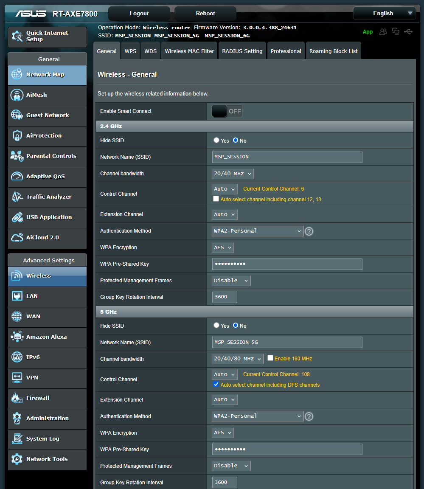
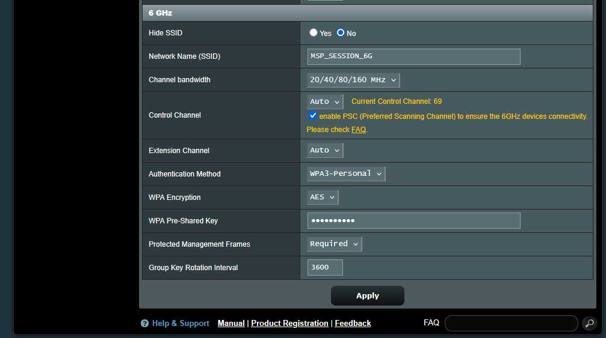
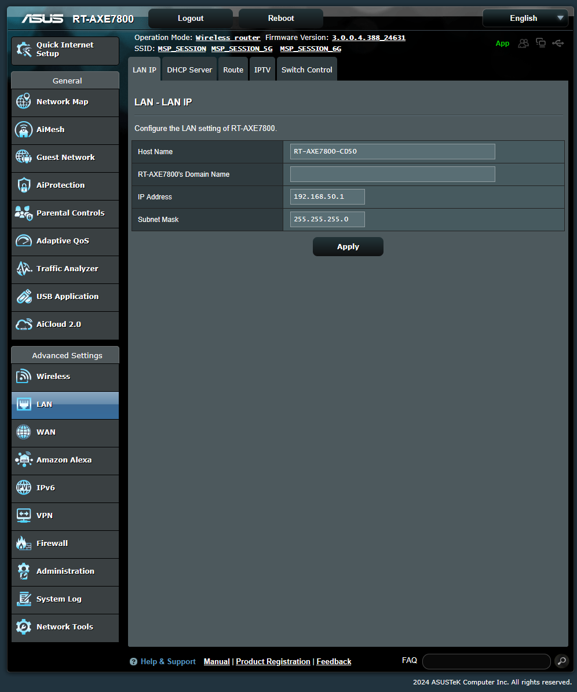
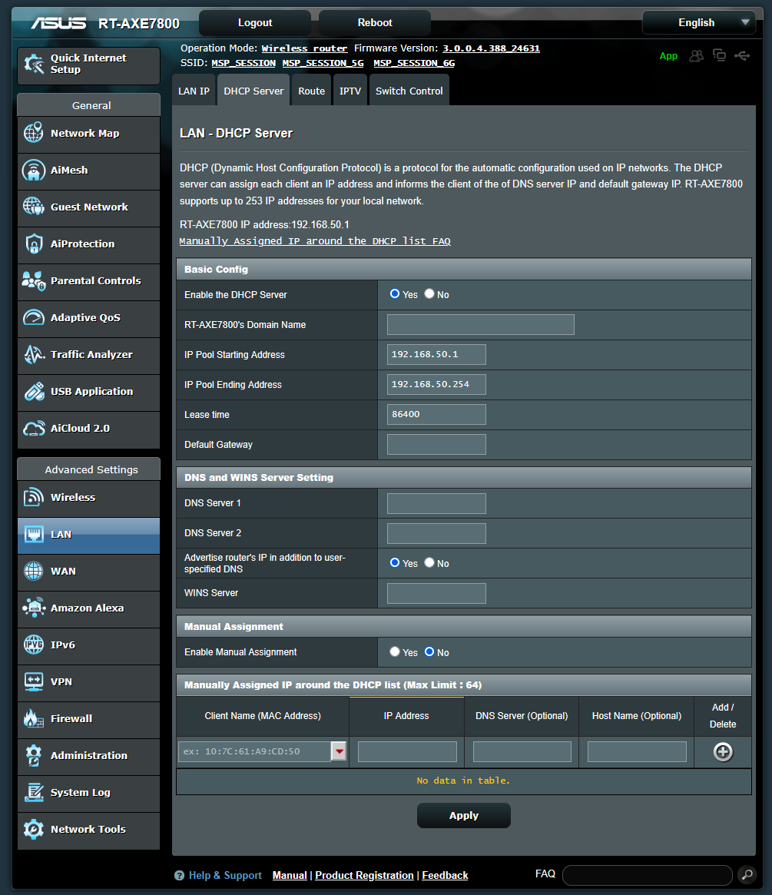
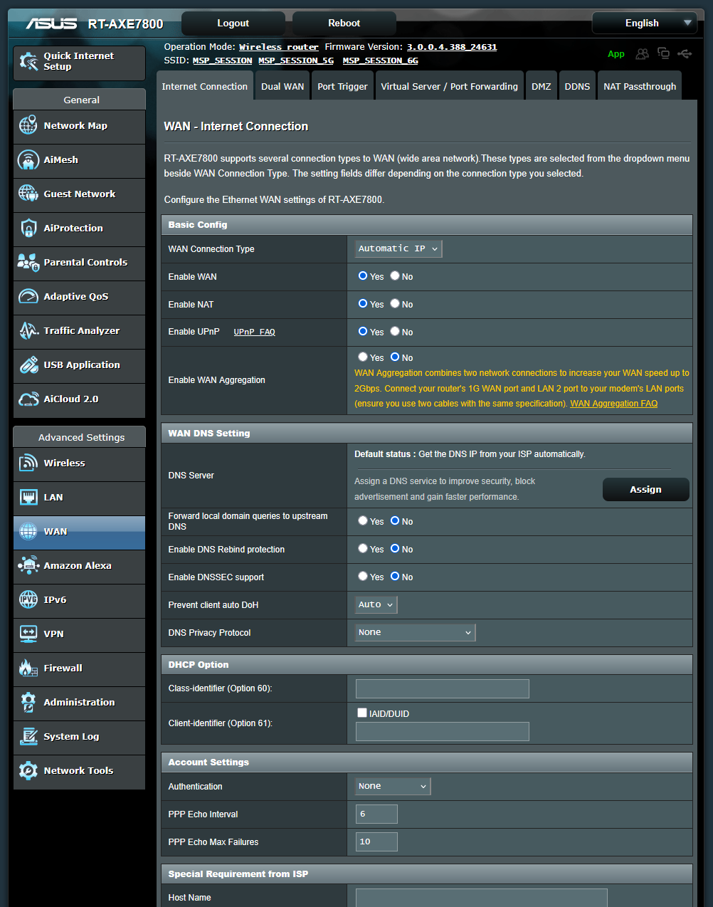

Find your your laptop's device name:
1. Open Windows File Explorer.
2. Right click on "This PC" and select "Properties".
3. The name is next to the field "Device name".
4. The name should be something like "DESKTOP-XXXXXXX".
5. You can select the name and copy it to the clipboard.

For your local MSP server, create a .env.local file in the MSP server folder, like this:
```dotenv
GEO_SERVER_DOWNLOADS_CACHE_LIFETIME=1209600
GEO_SERVER_RESULTS_CACHE_LIFETIME=1209600
APP_ENV=prod
SERVER_NAME=:80
URL_WEB_SERVER_HOST=DESKTOP-XXXXXXX
URL_WS_SERVER_HOST=DESKTOP-XXXXXXX
```
Make sure to change the DESKTOP-XXXXXXX to your device name.

To install the local MSP server, do the following:
(this will require a good internet connection)
1. Open a Git bash as administrator.
2. Navigate to the MSP server folder.
3. Type `source docker-alias.sh` and press enter.
4. Type `dcup` and press enter.'
5. Wait till you see a bunch of "Container...Started" messages
6. Type `dl -f` and press enter to monitor the PHP container logs. (You can exit by pressing Ctrl+C)
7. Wait till you see a "{"level":"info".. message
8. Open a browser and go to http://DESKTOP-XXXXXXX. Make sure to change the DESKTOP-XXXXXXX to your device name.
9. This opens the homepage of the MSP server. Click on "Go to Server Manager".
10. Login with your community.mspchallenge.info account login.
11. Now you can manage the sessions.

To install Grafana dashboards to monitor users, plans, energy distribution, errors and more, do the following:
(this will require a internet connection again)
1. First install the MSP server as described above.
2. Open a Git bash as administrator.
3. Navigate to the MSP server folder.
4. Type `source docker-alias.sh` and press enter.
5. Type `drg` and press enter.
6. You will see something like below:
   ```
    Error response from daemon: No such container: mspchallenge-grafana-1
    Error response from daemon: No such container: mspchallenge-grafana-1
    Unable to find image 'grafana/grafana-oss:9.1.7' locally
    9.1.7: Pulling from grafana/grafana-oss
    343f3ed96abe: Pull complete
    30462e7e88e1: Pull complete
    8d3d86e06141: Pull complete
    74ab4bfce13b: Pull complete
    44287bc3c75e: Pull complete
    6496a94db8f2: Pull complete
    9621f1afde84: Pull complete
    079cbc41cce2: Pull complete
    9b5c04940e34: Pull complete
    Digest: sha256:8b81f1225bc450e56cdcaffbfa5a051b891c8332789960e7362c38edba73a123
    Status: Downloaded newer image for grafana/grafana-oss:9.1.7
    608b53a22085168f1cfef6d4a1bdd72bc69440ba4a5a743ee6d86c283957ffd2
   ```
7. Open a browser and go to http://DESKTOP-XXXXXXX. Make sure to change the DESKTOP-XXXXXXX to your device name.
8. This opens the homepage of the MSP server. Click on "Go to Grafana dashboards".
9. Login using admin/admin.
10. Change the password to ASUSR25112. This is also the password for the router Wi-Fi.
11. Click "MSP Challenge session monitoring dashboard".
12. On the top left you can choose between session 1-9. Of course it won't show data if that session is not running.
13. Next to it there is a "Country" where you can select all countries or a specific ones.
14. In the top right there is "Cycle view mode"-button. Pressing this will cycle through different views, one of them being a fullscreen view.

Check the DHCP internet range:
1. Make sure you have an internet connection using Wi-Fi. Use the one provided at the Event location.
2. Open a command prompt.
3. Type `ipconfig` and press enter.
4. Look for the "Wireless LAN adapter Wi-Fi" section.
5. Look for the "IPv4 Address" and "Subnet Mask".
6. Look at the first three numbers separated by dots.
7. They should be not be equal to 192.168.50.xxx. Otherwise the network will conflict with the router.
8. If ***it is*** equal to 192.168.50.xxx make sure to change it in the steps below later.

How to setup MSP server connection to the router:
And how to gain internet access as well as a connection to the router, do the following:
1. Disconnect from the Wi-Fi network if you are connected to any.
2. Take the Asus R25112 router and connect it to a power socket. Then power it on by setting the power switch to "on". It's a the bottom.
3. Open up the Wi-Fi connection list and monitor it until you see a MSP_SESSION_6G, MSP_SESSION_5G or MSP_SESSION Wi-Fi SSID, which means the router has been booted up. !!Do not connect to this Wi-Fi though!!
4. Now wire a network cable from your laptop to the router on port LAN 2, 3 or 4, see the labelling at the back of the router.
5. Open a browser and go to http://192.168.50.1. The password is in Passbolt. Search for r25112. You can access the router by cable, while having internet through the Wi-Fi.
6. In case you need to change the DHCP IP range, do it now. (See "DHCP Server" screenshots below)
7. If all is applied, lets go back to the Wi-Fi connection list and connect to the Event's Wi-Fi having internet
8. Check if you have internet access using the browser.

For participants to connect to the session, do the following:
1. Connect to MSP_SESSION_6G, MSP_SESSION_5G or MSP_SESSION Wi-Fi
2. Enter password ASUSR25112. Note that the label on the top of the router has the password as well.
3. Launch the client
4. Connect to http://DESKTOP-XXXXXXX. Make sure to change the DESKTOP-XXXXXXX to your device name.
5. Join a session
6. Please note that the Wi-Fi won't have internet access but allows participants to connect to the MSP server.
   Once they have joined the session - showing the map - they can switch to the Event Wi-Fi for internet access.

The router is setup like shown in the screenshots below:





On this screen you can change the DHCP Ip range if needed. It's the "IP Pool Starting Address" and -"Ending Address":



You might want to try to connect a wired internet cable to the 2.5G WAN port of the router.
If it can automatically connect to the internet, the router Wi-Fi will have internet access as well I think.
However note Hotel's Wi-Fi often require you to login using a browser page, which will be difficult for a router...
There is an option for "Authentication" in the "Account Settings" that might be worth a try
But personally I wouldn't put effort into this if indeed the Hotel's Wi-Fi is using a browser page.



I also captured a video of all the settings screens just in case, open the link below:

[Click here](https://edubuas-my.sharepoint.com/:v:/g/personal/hekman_m_buas_nl/EUJTlPHegdRGghiZoYwaOBABOgdKSzSAULQB1TWeiOeMKg?e=EXfzLP)
