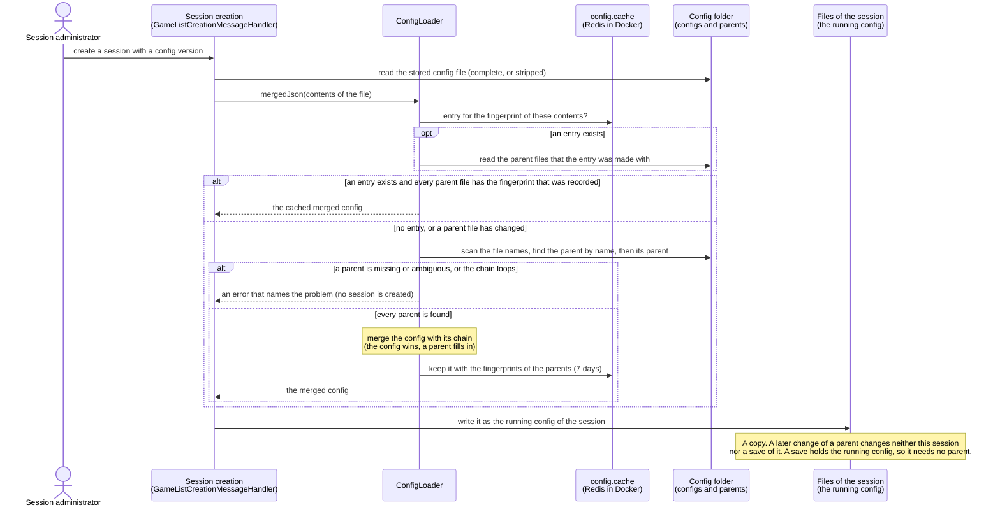
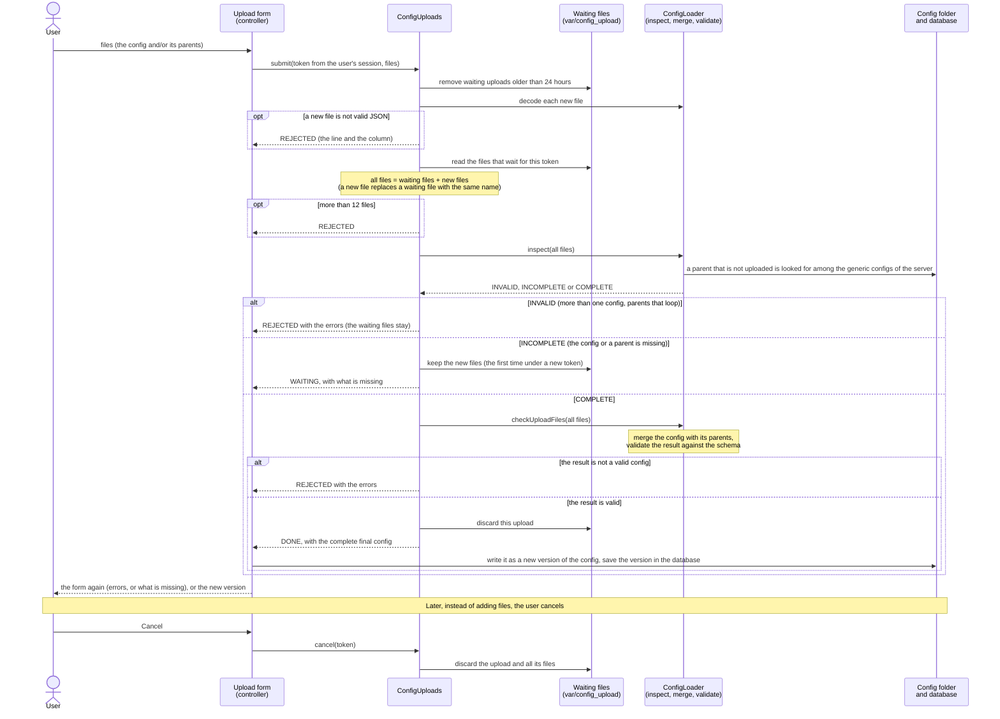

# Config simplification: implementation design

> The diagrams in this document are Mermaid. Their sources are the files in [`diagrams/`](diagrams/) (open one on GitHub to see it on its own, or in a Mermaid editor to change it). The same text is in the document, so that it shows where it is read; `ConfigDocsTest` fails when a diagram in the document and its file differ.

This page describes the choices that were made and how the implementation works. It follows the page **Config simplification**.

It does not describe code. It describes behaviour: what a config is, how configs are combined, what users and tools can expect.

## 1. The idea

The configs of the regions repeat most of their data. A config is now split in two:

- a **generic config** with the data that regions share, and
- a **region config** with what is specific to one region, adding to or overriding the generic data.

When a config is used, the two are **merged** into one **final config**. The final config is what the game, the simulations and the client work with. It is complete, and it does not refer to its parts any more.

Two principles decide where data lives:

- **Data that two or more regions share is generic.** Data that only one region uses is in that region.
- **A region can add to generic data and override it, but it can not take it away.** What a region is not allowed to take away must therefore only be generic when every region that is affected has it.

## 2. Concepts

| Term | Meaning |
|---|---|
| **Generic config** | A config with shared data. Its layers have a *generic name* and no region layer name. |
| **Region config** | A config for one region. It names a parent and holds only what differs from it. Also called a child config. |
| **Parent / child** | A config names its parent in `metadata.parent`. The parent can have a parent itself. |
| **Chain** | A config with its parent, the parent of that, and so on. The data of the parents is combined first, from the top down. |
| **Generic name** | The name that stands for "the same layer" in all regions, for example `PlayArea`. The layers of the regions have their own names (`_PLAYAREA_NS`), and the generic name connects them. |
| **Final config** | The result of merging a config with its chain. Complete, with no `metadata.parent` and no generic names. |
| **Complete config** | A config that needs no parent. A final config is one. A config in the old format is one too. |

## 3. How configs are organised

- **A parent is found by its name.** A generic config is a file named after what it is (`generic.json`, `generic_NS.json`, a restricted one). The name without `.json` is what a child writes in `metadata.parent`, and the file is looked for **anywhere below the config root**. The folders are free: they can be used to organise the configs as the editor wants, and moving a file to another folder changes nothing, as long as the root is the same.
- **Names have to be unique** in the tree. If two files have the name of a parent, that is an error that names both files. This is checked when the parent is looked up (so, not for names that nobody asks for). A file is only a parent when its content says so: a config that happens to have the name of a parent is reported as "cannot be a parent".
- **A region config is a config anywhere below the root.** It is either stripped (it names a parent and holds only what differs), or complete. A config is told by its content (a JSON file with layers that is not a generic config), so notes and other JSON next to it are left alone. The shipped layout (`North_Sea_basic/North_Sea_basic_1.json`, the parents in the root) is just a special case, and it is the layout that the Server Manager uses for the configs that are uploaded.
- A chain has at most 8 levels. Parents that loop, a parent that does not exist, a parent that two files have the name of, and a parent that is not a generic config are errors that are reported with the file that is the problem.
- **The same rule everywhere.** The commands, the upload, and the Server Manager use the same code to find a parent. The names of the files are listed once for a merge (a scan of the names, a few milliseconds also for 1500 files), nothing is read but the parents that are needed.
- Every generic config carries the map from the layer names that regions use to the generic name (`layer_names`). That map is only used when a complete config is turned into a stripped one; it plays no part in merging.
- **Public and restricted.** The public generic config is released with the configs. A restricted config names the public (or another restricted) config as its parent. It can be kept out of the release and be uploaded by someone who is allowed to have it.

### What the editor is expected to do

The editor is a separate piece of work, and this is what the design asks of it:

1. **Show the merged result.** Someone who edits a region config sees the final config, so they see what the game will see, and can tell which values come from a parent.
2. **Save only what differs.** A region config that is saved holds `metadata.parent`, and only the data that differs from its chain. The same rules that merge a config also say what "differs" is, so what is saved always merges back into what was edited. The tools in section 8 can check that.
3. **Ask where a change belongs.** A change to a value that comes from a parent is either an *override* in this region, or a change of the parent, which affects all its children. The editor should make that choice visible and warn about the children of a parent.
4. **Layers.** A layer that only this region uses is kept in the region, without a generic name. A layer that is picked from the generic config is a region layer entry with the generic name. Sections that refer to layers use the generic name for a generic layer, and the layer's own name for a layer of the region.
5. **"Nothing" and "reset".** To say that a region has no simulation, such as no MEL, the editor writes an explicit `null`. To undo an override, it removes the key, so the value comes from the parent again.
6. **Keep what it does not know.** `simulation_settings` is open-ended: other simulations can be there. The editor must keep entries it does not understand when it saves.
7. **Complete configs.** The editor may also write a complete config (for example to hand to someone who does not have the parent files). The server accepts both.

## 4. The final config from the user's point of view

- **Creating a session.** The config version that is chosen is merged with its chain at that moment. The result is the *running config* of the session, and it is a copy: changing a parent later does not change a session that is running, or a session that is restored from a save.
- **Saves.** A save holds the running config. A save is therefore complete, and works without any parent.
- **Download.** A download is always the complete final config. It can be uploaded on another server, and it can be edited and uploaded again.
- **Upload.** A complete config, or a config together with its parents (section 5). What is stored is the complete final config.
- **Configs that were shipped stripped.** They are merged when they are used, with the generic config that is on the server at that moment. So a change to the generic config of the server reaches new sessions that use them.
- **Old configs.** Complete configs in the old format keep working everywhere: upload, saves, imports, exports of plans. They are normalised when they are read.
- **Final config format.** It is the format that the client has always had, with two differences: the settings of the simulations are in `simulation_settings` (and still readable directly in `datamodel`, section 6.5), and the layer fields that were dropped are not in the final config of a stripped config (a complete config that still has them keeps them).

### Creating a session, step by step

Source: [diagrams/session-loading-sequence.mmd](diagrams/session-loading-sequence.mmd)

The merged config of a stored config is made by one loader (`ConfigLoader::mergedJson()`), and everything that needs the final config of a stored file uses it, so they share the cache: creating a session, the download (`mergedJsonOfFile()`), and the Server Manager where it shows or reads a config. The parent files are read at every call (the entry in the cache is only used when their content is still the one it was made with), so a long-running worker notices a changed parent without a restart. A cache that does not work is no reason not to load a config: the config is merged without it.

## 5. Uploading a config

The upload takes one or more files in one go: the config, and the parent files it needs that the server does not have.

**Complete config.** One file that needs no parent is processed at once, like before. It can be in the old or in the new shape.

**Config with parents.** The files are looked at together:

1. The files that are generic configs are the possible parents. The one that is not is the config. There has to be exactly one config in an upload.
2. The parent that the config names is looked for among the uploaded files, by name, and then among the generic configs of the server. A parent is looked for in the same way for each parent in turn. Uploaded files are used before the files of the server. Only a `.json` file can be a parent, and the name is the name of the file without `.json`.
3. When everything is there, the files are merged, the result is checked, and the complete final config is stored. **The parents are used for this and are not stored.** The stored config does not depend on them.

**When something is missing.** If a parent is missing, or only parents were uploaded and not the config itself, nothing is processed. The files that were uploaded are kept for the user, and the form says what is missing (for example: *Missing: public.json, the parent of north_sea.json*). The user uploads the missing files (also in more steps), and as soon as everything is there it is processed. The form's other fields (name, description) are kept.

**Cancel.** The user can cancel. All the files that were uploaded are discarded. Files that are not completed are also removed after 24 hours.

**Rejected files.** A submission is refused as a whole, and nothing of it is kept, when:

- a file is not valid JSON (the message gives the line and the column),
- there is more than one config in the upload, or the parents loop,
- there are more than 12 files,
- or the complete result is not a valid config (the messages are those of the check in section 9).

What was kept from earlier submissions stays, so the user only uploads the files that have to be corrected. A file with the name of a file that is kept replaces it.

**Privacy.** What is kept belongs to the session of the user who uploaded it, and is not visible to others.

### The upload, step by step

Source: [diagrams/upload-sequence.mmd](diagrams/upload-sequence.mmd)

What the form is told is one of four states (`UploadProgress`): *idle* (nothing waits), *waiting* (files are kept and something is missing), *rejected* (the submission is refused, with the messages, and the files that were waiting stay), and *done* (the complete final config is there and is stored as a new version). Only the files of a submission that leaves the upload *waiting* are kept; a refused submission keeps nothing of itself. The token that points to the waiting files is only in the session of the user.

## 6. How merging works

### 6.1 In short

1. The chain is merged from the top down: the parent of the parent first, then the parent, and so on. The result is the *pool* of generic data. Two generic configs are merged with the same rules as below, where the layers of a child are matched to those of its parent by their generic name.
2. The pool is merged with the region config, which gives the final config.

### 6.2 The rules

| Part of the config | Rule |
|---|---|
| **Layers** (`meta`) | The region config lists its layers, in its order. This decides which layers exist. A layer entry with a generic name takes the generic layer as its base; a layer without a generic name is used as it is. Generic layers that the region does not list are not in the final config. |
| **Fields of a layer** | Merged field by field. |
| **Restrictions** | Added up: the generic ones first, then the ones of the region. A generic restriction that refers to a layer that the region does not have is skipped. |
| **Dependencies** | Replaced as a whole. When the region has dependencies, only those are used, nothing is combined. |
| **Simulation settings** | Section 6.4. |
| **Policy settings, plans** | Region only. They are not touched. |
| **The other fields** (`edition_name`, `start`, `minzoom`, `wiki_base_url`, and so on) | Region only. |
| **Metadata** | Of the region. `parent` is not in the final config. |

### 6.3 Nothing, deep merging, and replacing

- **Absent means inherit.** A value that the region does not mention comes from the generic config.
- **An object is merged one level at a time.** Objects are merged key by key, as deep as they go. Where the region has a key, its value wins; where it does not, the generic value stays. This is how a layer type can be changed in one field (`layer_type` → `"0"` → `polygonColor`) and keep all its other fields.
- **Lists and plain values replace.** A list in the region replaces the whole generic list (for example `layer_states`, `layer_tags`), and so does a plain value (a number, a text, true or false). Items are not combined, except for the lists in the next point.
- **`null` replaces too.** A region that has `null` for a value gets `null`, also when the generic value is an object or a list. That is the way to say "this region has none of it". For a simulation (section 6.4), a `null` also means that the generic one is not inherited.
- **Lists that add up.** Restrictions, the lists of SEL (`shipping_lane_layers`, `port_layers`, `restriction_layer_exceptions`) and `layer_info_properties` do not replace: the generic items come first, then those of the region. For the first ones a generic item that refers to a layer that the region does not have is skipped. `layer_info_properties` are keyed (below).
- **Where objects are merged deeply:** the fields of a layer (including its types), each simulation in `simulation_settings`, and the settings inside SEL, MEL and CEL. **Where nothing is merged:** dependencies, plans, policy settings, and the lists that replace.

**Order.** In a list that adds up, the generic items come first and then those of the region. The generic items are in a fixed order (sorted by content for restrictions and the SEL lists, the order of the generic config for layer properties), so a region does not keep the order of the config it was made from. The order of the layers (`meta`) is always the region's own.

**Layer properties are keyed by name.** An item of `layer_info_properties` is identified by its `property_name`. A region item with the same name as a generic item is merged into it (the region wins field by field), in the place of the generic item. Region items with other names come after the generic ones.

### 6.4 Simulation settings

`simulation_settings` is open-ended: every key of it is a simulation. They are all merged in the same way:

- if only the generic config has it, it is inherited,
- if only the region has it, it is used,
- if both have it and both are objects, they are merged deeply,
- if the region has `null`, the result is `null`: no such simulation in this region, and the generic one is not inherited,
- if the region has something that is not an object, it replaces.

**CEL, SEL and MEL are always in the final config**, with `null` when a region has none of them. Settings of other simulations are only there when a config has them.

**SEL** has some rules of its own: the three lists above add up, and the references to layers in it (`country_border_layer`, `port_layers`, and so on) are stored with generic names in the generic and the region config, and become the layer names of the region in the final config. Some SEL settings are always region-specific (`port_intensity`).

**MEL** is region-specific, except the categories of the KPIs, which can be generic. The value definitions of the categories are not in a split config: the client handles them.

### 6.5 Compatibility with the old format

- **Both shapes are readable.** The final config has the simulations in `simulation_settings`. They can also be read directly in `datamodel` (`datamodel.SEL`, and so on), as the code that was there before expects. When the code that reads them is moved to `simulation_settings`, this can go.
- **Other simulations.** All keys of `simulation_settings` can be read directly in `datamodel`, unless the name is already used by something else in `datamodel`.
- **Old configs.** A config in the old format has CEL, SEL, MEL (and REL) directly in `datamodel`. It is accepted everywhere. Merged with a parent, a simulation in the old format wins over the same one in `simulation_settings`; an old-style list in SEL replaces the lists of the other layers, and an old-style `null` means no simulation.
- **Old sessions and saves.** Their running config is in the old format on disk, and is normalised when it is read.
- **Dropped fields.** `layer_information` and `layer_raster_filter_mode` are not in a split config and are not needed. `layer_width` and `layer_height` are only kept for raster layers. A complete config that still has them is not changed when it is merged; they only go when a config is converted to a stripped one.

## 7. What becomes generic

When complete configs are converted (see section 8), the rules for "shared" are the same everywhere: **two or more regions share it**.

| Data | When it is generic |
|---|---|
| **A layer** | Two or more regions use it. A layer that one region uses stays in that region. |
| **A field of a shared layer** | A shared layer always has a complete definition in the generic config. The generic value is the most common value among the regions, or the one of the first region when no value is more common. A region with another value overrides it. |
| **A restriction or a list item that refers to layers** | Every region that has the layers it refers to has it, and two or more regions have those layers. An item that refers to a layer of one region only is never generic. |
| **A layer property** | Every region has it, and two or more share a version of it. A region with another version carries that version. |
| **A value in a section** (CEL, SEL, dependencies, other simulations) | Two or more regions have the same value. Other regions override it. A key of an object that not every region has stays in the regions. |
| **A simulation other than CEL, SEL, MEL** | Every config has it, and then the rule above. |
| **Policy settings, plans, other top-level fields** | Never. |

A region can not take away what is generic, which is why an item that only some of the regions with the same layers share stays in those regions.

A converted config always merges back into what it was made from (apart from the documented removals). The tools check this before they write anything.

## 8. Tools for developers

Six commands work on a folder with configs:

- **split** turns complete configs into a generic config and stripped region configs (a report says what became generic and what was overridden, with the size of every file now and as it would be written). It takes every config below the root, in any folder, and writes each stripped config where it was; an existing generic config is written where it is, a new one goes in the root. It can be run again on configs that are split already: layers that other configs now use move into the generic config, and the other way round. It only writes when all configs merge back into what they were, and writes all or nothing. A *check* option says whether anything would change. A JSON file that is not valid can not be told from a config: it is left out and reported, and nothing is written as long as there is one (leave it out with the pattern, or fix it).
- **strip** strips one config against the generic configs that it is told to use, and warns about the layers that could not be stripped.
- **merge** gives the final config of a stripped config.
- **verify** proves for a folder that every stripped config merges back into the original that it was made from.
- **validate** checks configs the way an upload is checked (the final config against the schema, raster layers need their size), per file, with the line and column of a syntax error.
- **list** shows what is in a tree: the configs, the parents, who uses which parent, names that two files have, and what is wrong.

All of them can tell a program what they found: with the option `--format=json` a command prints one JSON document (with a version, the result, and errors and warnings that have a code that does not change), and its exit code tells whether it went well. The commands also exist without the server, as a tool of their own (`config-tools`) that can be run in any folder with configs, for example in the build of a configs repository or by the config editor. Its reference is `docs/config-tools-cli.md` in the code.

## 9. Checking a config

A final config is checked against one description (the schema) when it is uploaded, when a session is created from it, and when a saved session is checked. Besides the schema there is one rule: a raster layer must have `layer_width` and `layer_height`. Errors say what is wrong, and where: for invalid JSON the line and the column, for the rest the place in the config.

## 10. Limits and design constraints

- **A region can not take away generic data.** Data that is shared by some, but not all, of the regions that have the same layers stays in the regions. A way to exclude a generic item in a region would change that, at the price of a more complicated config.
- **Settings of another simulation** only become generic when every config has them.
- **The order of the items of a list that adds up is not kept** (restrictions, the SEL lists, layer properties): the generic items come first, in a fixed order. The server does not depend on that order. Whether the client shows layer properties in list order has to be checked; if it does, a region needs a way to say how its properties are ordered.
- **Layer properties without a `property_name`, or with the same name twice in one layer,** can not be keyed. They are kept as they are, in the regions.
- **A chain has at most 8 levels,** an upload at most 12 files and one config.
- **The names of parents have to be unique in the whole tree.** The editor has to enforce it. A second file with the name of a parent that is already in the cache of a merge is not noticed by that merge (the cache entry is used as long as the files it was made with are unchanged), but by the next merge that is not in the cache, and by verify.
- **Parents of an upload are not stored.** A restricted config that is uploaded has to be uploaded with its parents every time, unless the server has them.
- **The MEL format is not changed** here. Simplifying it is a separate piece of work.

## 11. Performance and release

- **Speed.** (The steps are in the diagram in section 4.) Merging a config takes some tens of milliseconds. The result is kept, and used again as long as the config and the parents it was made with are unchanged (they are compared by content, not by their modification date), so the cost of a config that is used again is about what it was before configs were merged.
- **Release.** The configs on production and staging are in a volume, that is filled from the release only when it is created. A release that changes the configs does not reach an existing volume by itself. Before released configs are stripped, there has to be a way to bring the generic config and the stripped configs to a volume that exists already.
